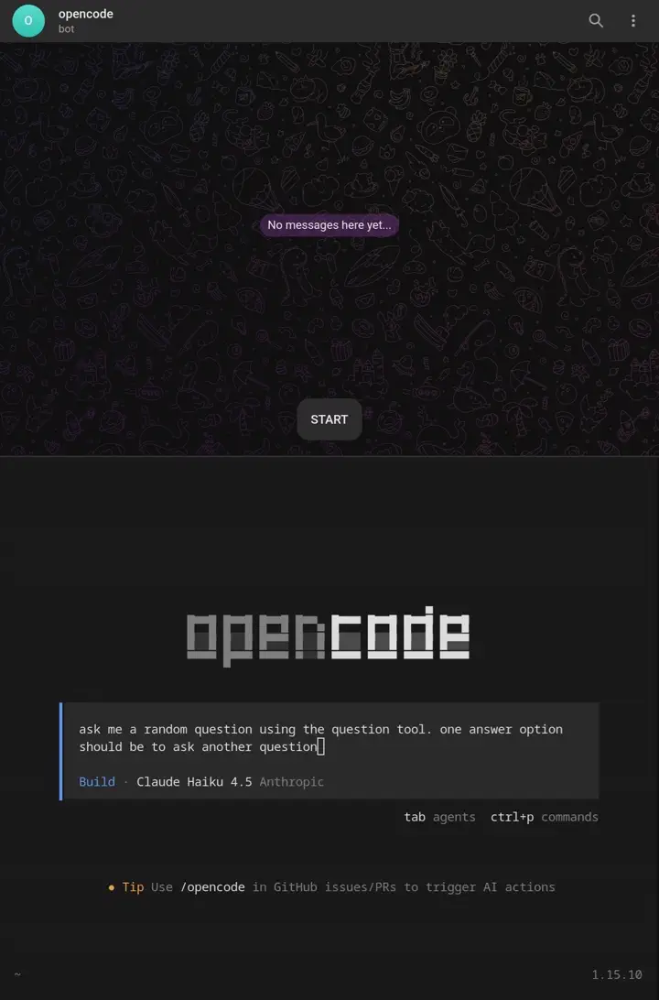

# opencode-telegram-question

Mirror opencode's built-in `question` tool and permission prompts to a
Telegram bot. When opencode pauses for input while you're AFK, answer it
from your phone. The CLI session keeps working as if you'd answered
locally.

<p align="left">
  
</p>

For a higher-quality version with scrubbing, open [docs/demo.mp4](docs/demo.mp4).

The plugin does **not** patch the opencode binary. It is a regular plugin
that hooks into opencode's bus events and the public SDK client; it should
keep working across minor opencode upgrades.

## How it works

### Questions

1. opencode's `question` tool publishes `question.asked` on the internal bus
   with the full request (including sub-questions, options, `multiple` and
   `custom` flags).
2. This plugin's `event` hook receives that event, sends one Telegram
   message per sub-question, with inline-keyboard buttons for each option
   plus a "Type your own answer" entry. Each message is formatted with
   Telegram HTML (bold header, italic session label and "Recent context"
   prefix) and labeled with the source session's title so it's obvious
   which opencode session asked when several sessions share the bot. The
   first message also includes a short transcript of the last few session
   messages for context (text, reasoning, and tool titles). The most recent
   message gets a generous budget shown from its tail (the end of the last
   message usually carries the detail the question is about); older messages
   are kept short as breadcrumbs. There is
   intentionally no "Cancel"
   button: rejecting a question propagates as a tool error, and a misclick
   on a phone keyboard shouldn't be able to kill an in-flight request. To
   cancel, reject from the CLI/TUI; the plugin will then delete its stale
   Telegram messages via `question.rejected`.
3. When you tap a button (or send a free-text reply), the plugin assembles
   the answer array and calls `POST /question/{id}/reply` via the SDK
   client. opencode unblocks the tool and the session continues. The
   Telegram message is edited in place: chosen options are marked with
   `(check)` and the inline keyboard is removed, so you keep a record of
   what you answered.
4. If you answer in the CLI/TUI instead, the bus emits `question.replied`
   (or `question.rejected`), and the plugin deletes its Telegram messages
   so you don't see stale buttons.

### Permissions

When a tool needs your approval, opencode publishes `permission.asked`.
The plugin renders the tool name, requested patterns, and any metadata as
a chat message with three inline buttons: **Allow once**, **Always
allow**, **Reject**. Tapping a button calls `POST /permission/{id}/reply`
and the blocked tool resumes. As with questions, CLI/TUI approvals
delete the now-stale chat message via the `permission.replied` event.

### Free text and the "Draft:" indicator

Free-text answers use Telegram's `force_reply`, so tapping "Type your own
answer" pops the reply composer pre-quoted to the question. Concurrent
custom prompts (one per sub-question) are routed back to the correct
slot via `reply_to_message_id`.

A side effect of `force_reply` is that Telegram clients mark the chat
with "Draft:" in the chat list as soon as the prompt is sent, even
before you type anything. The Bot API offers no method to clear that
indicator; the plugin minimizes it by (a) only arming `force_reply`
*after* you tap "Type your own answer", and (b) deleting the force-reply
prompt as soon as the question resolves. Inline-button-only flows
(questions without `custom`, and all permission prompts) never trigger
the indicator.

Multi-question calls are supported: every sub-question gets its own
message, and the plugin only replies to opencode once all sub-questions
have been answered (preserving order).

Long free-text replies are coalesced. Telegram clients split messages
longer than 4096 characters into multiple sends, each marked as a reply
to the same prompt. The plugin buffers all such chunks, waits for a
brief idle window (1.5s by default), then joins them in `message_id`
order and submits a single combined answer. The window is configurable
via the `freeTextDebounceMs` option on the controller; the default is a
safe choice for typical reply latency.

You can configure a list of stock free-text answers via `quickReplies`.
Each appears as an extra one-tap button below the options on every
question; tapping it submits the configured string as the answer. This
is useful for recurring responses like "decide yourself", "skip", or
"ask later" without having to type them every time.

## Setup

### 1. Create a Telegram bot

1. Open [@BotFather](https://t.me/BotFather) in Telegram and run `/newbot`.
   Follow the prompts to choose a name and username. BotFather will reply
   with a **bot token** that looks like `123456:AA...`. Save it.
2. Open the chat with your new bot and send it any message (e.g. `/start`).
   This makes the bot able to message you (Telegram blocks unsolicited
   outbound messages otherwise).

### 2. Find your chat id

Open [@userinfobot](https://t.me/userinfobot) in Telegram and send it any
message. It will reply with your numeric user id, which is what you pass
as `chatId` for a private 1:1 chat with your own bot.

### 3. Install the plugin

Add it to `~/.config/opencode/opencode.json`:

```jsonc
{
  "plugin": [
    [
      "github:m0wer/opencode-telegram-question",
      {
        "botToken": "123456:AA...",
        "chatId": 987654321,
        "historyMessages": 3,
        "quickReplies": [
          "Decide yourself. Continue with all remaining tasks and gaps without checkpoints; choose the order. Take decisions autonomously.",
          "Skip this one and move on."
        ]
      }
    ]
  ]
}
```

opencode resolves the spec through npm, which fetches the repo straight from
GitHub. Pin a specific commit or tag with `github:m0wer/opencode-telegram-question#v0.4.1`.

For local development, clone and reference the built file directly:

```bash
git clone https://github.com/m0wer/opencode-telegram-question.git
cd opencode-telegram-question
bun install
bun run build
```

```jsonc
{
  "plugin": [
    [
      "/absolute/path/to/opencode-telegram-question/dist/index.js",
      { "botToken": "...", "chatId": 0 }
    ]
  ]
}
```

### 4. Credentials

You can either pass them inline in `opencode.json` (as shown above) or
through the environment. Inline wins if both are set.

```bash
export TELEGRAM_BOT_TOKEN="123456:AA..."
export TELEGRAM_CHAT_ID="987654321"
```

Options:

| Key | Env fallback | Default | Notes |
|---|---|---|---|
| `botToken` | `TELEGRAM_BOT_TOKEN` | (required) | From [@BotFather](https://t.me/BotFather) |
| `chatId` | `TELEGRAM_CHAT_ID` | (required) | Your numeric user id from [@userinfobot](https://t.me/userinfobot) |
| `historyMessages` | `OPENCODE_TELEGRAM_HISTORY` | `3` | Lines of recent history prepended to the first sub-question |
| `quickReplies` | `OPENCODE_TELEGRAM_QUICK_REPLIES` | `[]` | List of stock free-text answers shown as extra one-tap buttons after the options. Tapping one submits its text as the answer. The env-var form accepts either a JSON array (e.g. `'["decide yourself","skip"]'`) or a comma-separated list. |
| `logFile` | (n/a) | platform default | Path to the plugin log file. Defaults to `$XDG_STATE_HOME/opencode-telegram-question/plugin.log` (POSIX) or `%LOCALAPPDATA%\opencode-telegram-question\plugin.log` (Windows). The plugin never writes to stdout/stderr, so the TUI stays clean; tail this file when debugging. |

If either credential is missing the plugin disables itself (with a warning)
and the CLI/TUI flow is unchanged.

## Security notes

- The plugin only accepts callback queries and messages from the configured
  `chatId`. Updates from other chats are ignored.
- The bot token grants full control of the bot; treat it like a password.

## Multiple opencode sessions

Telegram only allows a single concurrent long-poll per bot token, so the
plugin coordinates across opencode processes on the same machine via a
local IPC endpoint (Unix domain socket on Linux/macOS, named pipe on
Windows). The first process to start becomes the leader and runs the
poller; later sessions connect as followers and receive updates over the
socket. If the leader exits, the followers race to take over and one of
them becomes the new leader. Each process still issues its own outbound
Telegram calls (sendMessage, editMessage, deleteMessage); only the
inbound update stream is shared.

A consequence is that free-text replies are only consumed when the user
uses Telegram's Reply gesture against the plugin's force-reply prompt
(which the Telegram client triggers automatically when the user taps the
pre-filled reply). Stray messages typed into the chat are ignored.

## Development

```bash
bun install
bun test            # unit + integration tests against an in-memory transport
bun run typecheck
bun run build
```

Tests cover: single-choice, multi-choice, free-text with `force_reply`,
quick-reply buttons (rendering, submit, prompt cleanup, range checks),
concurrent custom-prompt routing via `reply_to_message`, split-chunk
coalescing for long free-text replies (in-order and out-of-order
delivery), CLI-resolves-during-buffer cancellation, multi sub-question
ordering, cancel/reject, CLI-answers-first cleanup, message edit-on-answer
behavior, chat-id isolation, multi-session IPC leader election and
broadcast, history part summarization (text/reasoning/tool titles), and
permission allow-once/always/reject flows.
